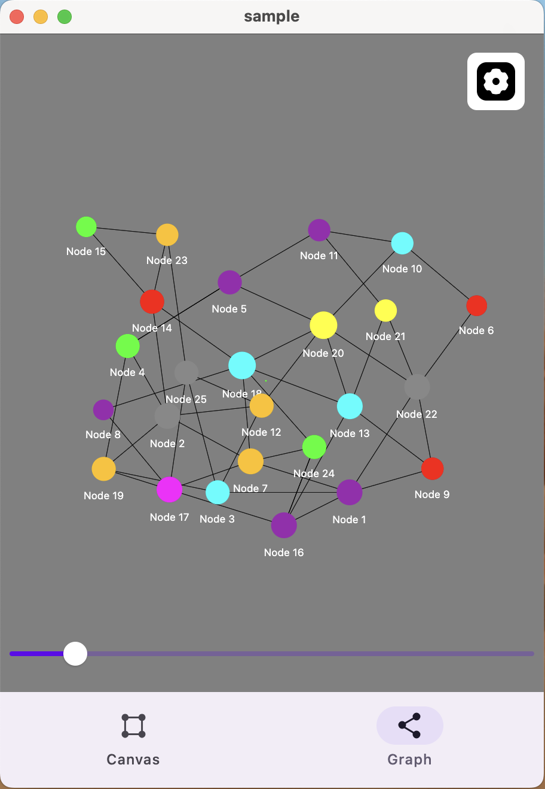

<p align="middle">
    
    
</p>

[android, wasm, js, ios, jvm, macos]

# compose-data-vizualization

You need Miro whiteboard or Graph nodes like in Obsidian App in Compose multiplatform?
<br/>
This library can help you. Most prepared motions and actions with Whiteboard and Graph are given.

Open demo site in wasm (mobile friendly):

https://composedataviz.3moly.com/

```gradle
implementation("io.github.3moly:compose-data-viz:0.1.0")

// The core module is needed only if you split models of this library from ui.
// (Be aware that it includes compose.foundation for Offset and Color classes)
implementation("io.github.3moly:compose-data-viz-core:0.1.0")
```

### Sample code

In sample module there is WhiteboardSample and GraphSample functions.
With them you can understand faster how to deal with the library.

### Whiteboard

The key part is a shape. For library it's important to know about 3 fields.

```kotlin
interface Shape {
    val id: Long
    val position: Offset
    val size: Offset
}
```


And you can inherit above interface for more fields you wish to use in a Drawing process.

```kotlin
data class CustomShape(
    override val id: Long,
    override val position: Offset,
    override val size: Offset,

    val backgroundColor: Color?,
    val data: ShapeData
) : Shape
```

So then every shape of your CustomShape will show through method in under code.
And Modifier with calculated size and location will show in DrawShapeState.
So you can use this Modifier for drawing Shape, you can draw any shape you want.

```kotlin
onDrawBlock: @Composable (DrawShapeState<ShapeType, Id>) -> Unit
```

```kotlin
@Composable
fun <ShapeType : Shape<Id>, Id> Whiteboard(
    consume: Boolean,
    modifier: Modifier,
    action: Action<ShapeType, Id>?,
    backgroundModifier: Modifier,
    connectionsModifier: Modifier,
    settings: CanvasSettings,
    zoom: Float,
    roundToNearest: Int?,
    connectionDragBlankId: Id,
    userCoordinate: Offset,
    isDrawing: Boolean,
    shapes: List<ShapeType>,
    connections: List<ShapeConnection<Id>>,
    drawingPaths: List<StylusPath>,
    onActionSet: (Action<ShapeType, Id>?) -> Unit,
    onAddPath: (StylusPath) -> Unit,
    onMoveShape: (Int, Offset) -> Unit,
    onResizeShape: (Int, Offset, Offset) -> Unit,
    onAddConnection: (AddShapeConnection<Id>) -> Unit,
    onZoomChange: (Float) -> Unit,
    onUserCoordinateChange: (Offset) -> Unit,
    settingsPanel: @Composable (position: Offset, action: Action<ShapeType, Id>, onDoneAction: () -> Unit) -> Unit,
    onDrawBlock: @Composable (DrawShapeState<ShapeType, Id>) -> Unit,
) {
    //...
}
```

### Graph

```kotlin
@Composable
fun <Id, Data> Graph(
    modifier: Modifier = Modifier,
    userPosition: Offset,
    zoom: Float,

    stateNodes: List<GraphNode<Id, Data>>,
    coordinates: Map<Id, Offset>,
    velocities: Map<Id, Offset>,
    connections: Map<Id, List<Id>>,

    viewSettings: GraphViewSettings,
    onCentralGlobalPosition: (Offset) -> Unit,
    onZoomChange: (Float) -> Unit,
    watchNodeId: Id? = null,
    io: CoroutineContext,
    onNodeClick: (GraphNode<Id, Data>) -> Unit,
    onCoordinatesUpdate: (Map<Id, Offset>) -> Unit = {},
    onVelocitiesUpdate: (Map<Id, Offset>) -> Unit = {},
    primaryColor: Color,
    fontColor: Color,
    circleColor: Color,
    circleLineColor: Color
) {
    //...
}
```

## Used in

- [CedarJam](https://github.com/3moly/CedarJam)
