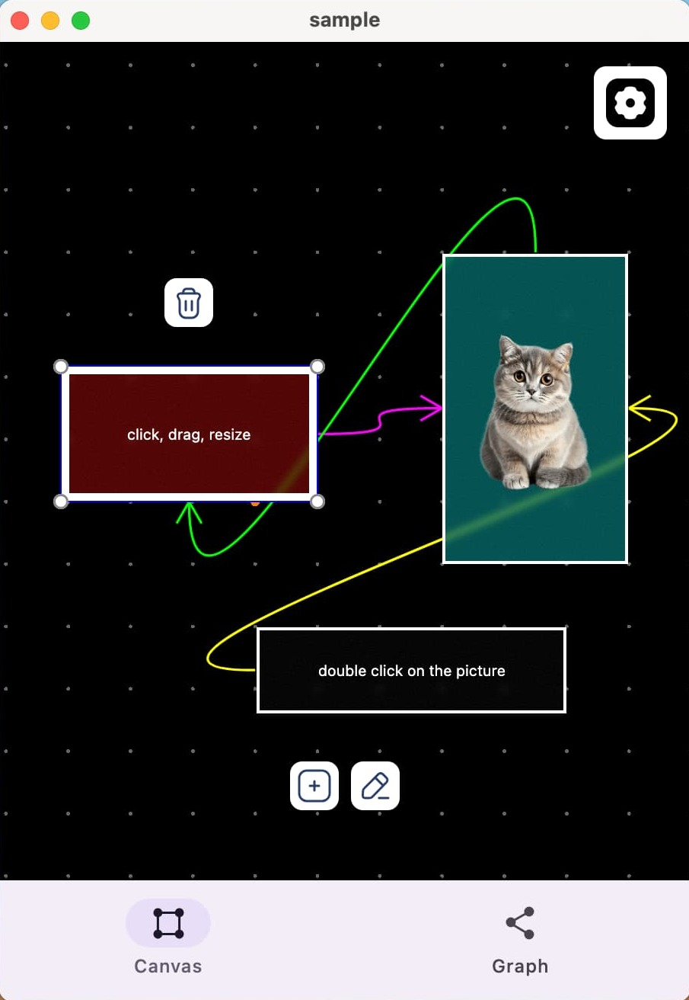
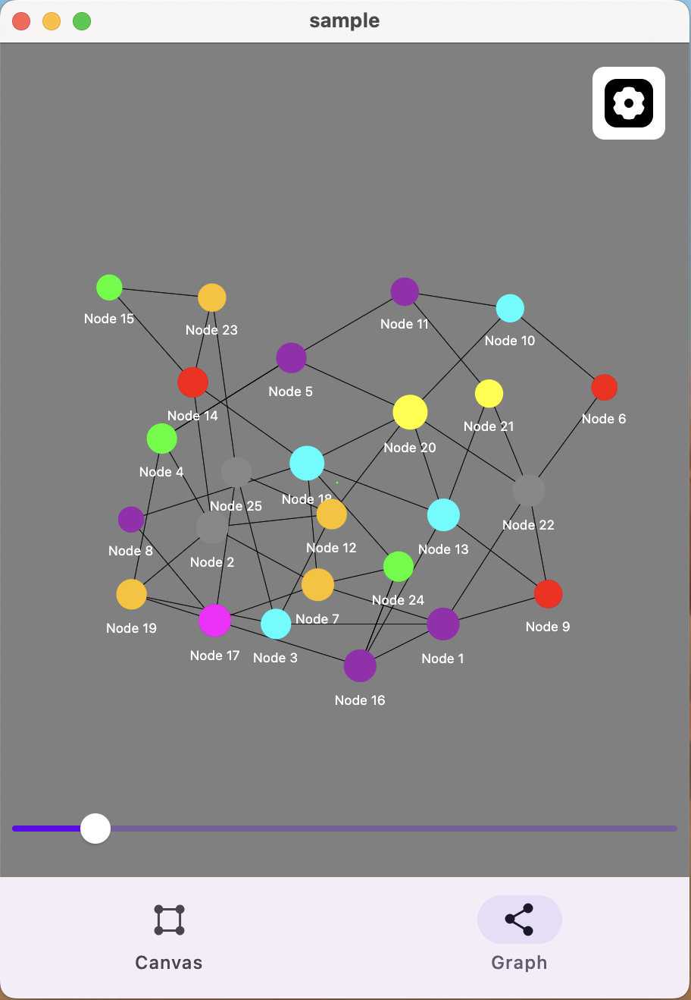

# compose-data-visualization

Interactive **Whiteboard** (Miro-style) and **Graph** (Obsidian-style) views for **Compose Multiplatform**.
Most of the common motions and actions are ready out of the box, so you can drop a canvas into your app and start wiring data to it.

> Need a Miro-like whiteboard, or an Obsidian-like node graph, in Compose Multiplatform? This library gives you both.

**Platforms:** Android · WASM · JS · iOS · JVM · macOS

🔗 **Live demo (WASM, mobile-friendly):** https://composedataviz.3moly.com/

<p align="middle">
    
    
</p>

---

## Installation

```kotlin
implementation("io.github.3moly:compose-data-viz:0.1.0")

// Core module — only needed if you keep this library's models separate from the UI.
// (Note: it pulls in compose.foundation for the Offset and Color classes.)
implementation("io.github.3moly:compose-data-viz-core:0.1.0")
```

## Sample code

The `sample` module contains `WhiteboardSample` and `GraphSample`. They're the fastest way to see how the pieces fit together.

---

# Graph

A force-directed, GPU-accelerated node graph built for large, live datasets. Nodes settle with smooth physics, render through a single SkSL shader, and stay interactive while you pan, zoom, and drag.

<!-- IMAGE PLACEHOLDER ───────────────────────────────────────────────
     Hero shot of the graph: a populated node graph with labels.
     Suggested path: docs/media/graph/hero.png
──────────────────────────────────────────────────────────────────── -->
<p align="middle">
    
</p>

## Features at a glance

| Area | What you get |
| --- | --- |
| **Physics** | Force-directed layout with a frame-paced engine — motion looks identical on fast and slow machines |
| **Rendering** | All nodes drawn in one SkSL shader pass: circular masking, anti-aliasing, and borders on the GPU |
| **Icons** | Tiered SVG/painter atlas — icons composited into textures and swapped by distance to the viewport |
| **Labels** | Distance-ranked labels, zoom-aware scaling, fade thresholds, and "pill" backgrounds for the active node |
| **Edges** | Directed arrows, dashed/dotted patterns, zoom-based visibility, and a fast pure-lines mode |
| **Groups** | Convex-hull outlines around node groups, with fills and zoom-scaled hull labels |
| **Interaction** | Pan, pinch & scroll zoom, node drag, tap-to-select, and hover highlighting |
| **Camera** | "Watch" a node so the view follows it as the layout moves |
| **Focus** | Dim and fade everything except the selected node and its connections |
| **Persistence** | Coordinate callbacks so you can save and restore layout positions |

---

## How it works

### Force-directed physics

Layout is driven by the built-in `UltraFastEngine`. The key design choice is that it is **frame-paced** — exactly one physics step per visible frame rather than "as fast as the CPU allows" — so a graph that runs at 200 Hz on a desktop and 60 Hz on a phone still *moves at the same speed*. Slow machines visibly drop frames instead of running the simulation faster.

You can tune the feel through a handful of knobs:

- **`globalMotionScale`** — the master speed governor ("make everything slower").
- **`maxDisplacementPerFrame`** — a safety cap so nothing teleports on a heavy frame.
- **`velocitySmoothing`** — ease-in/out lag. Lower = cinematic, higher = snappy.
- **Sub-stepping**, **anti-clump spreading**, and **partial freeze on drag** keep dense graphs stable.

The engine also sleeps when settled and "reheats" on changes or drags, so an idle graph costs almost nothing.

<!-- IMAGE PLACEHOLDER ───────────────────────────────────────────────
     Ideally a GIF: nodes settling into a force-directed layout.
     Suggested path: docs/media/graph/physics.gif
──────────────────────────────────────────────────────────────────── -->
<p align="middle">
    
</p>

### GPU node rendering

Every node circle is rendered in a single SkSL shader pass: circular masking with quality-tunable anti-aliasing, optional borders, and multi-layer icon atlases — all on the GPU. This is what keeps large graphs smooth instead of issuing one draw call per node.

### Tiered icon atlas

`rememberAtlasComposer` turns your node icons (any `Painter`, including SVGs) into texture atlases, composited off the main thread on `Dispatchers.Default`. Tiers decide *which* nodes get icons:

- `TierSelection.All` — every node.
- `TierSelection.AllVisible` — only what's on screen.
- `TierSelection.TopByDistance(n)` — the `n` nodes closest to the viewport center.

Tiers can **freeze on move** (skip rebuilds while panning), load painters with a **concurrency limit**, and mark layers **circular** or pass-through. Static shared icons are supported alongside per-node icons.

<!-- IMAGE PLACEHOLDER ───────────────────────────────────────────────
     Show nodes rendered with icons / avatars inside the circles.
     Suggested path: docs/media/graph/icons.png
──────────────────────────────────────────────────────────────────── -->
<p align="middle">
    
</p>

### Labels

Labels are ranked by distance to the center and capped by `maxLabelsVisible`, so a busy graph never drowns in text. They scale with zoom (within min/max bounds), fade in across a zoom threshold, and the active node gets a rounded "pill" background for emphasis.

### Edges

Connections render as directed edges with configurable arrow heads, dashed or dotted patterns, and stroke-width scaling policies. Edges fade out below a zoom threshold and highlight when their endpoints are selected. For very large graphs, a **pure-lines** mode skips styling entirely for maximum throughput.

<!-- IMAGE PLACEHOLDER ───────────────────────────────────────────────
     Close-up of edges: arrows + dashed/dotted styles.
     Suggested path: docs/media/graph/edges.png
──────────────────────────────────────────────────────────────────── -->
<p align="middle">
    
</p>

### Groups & convex hulls

Pass a `GroupModel` and the graph wraps each group in a convex-hull outline, with optional fill and a label that scales and fades with zoom. Hulls recompute on a background controller and slow down automatically once the layout settles.

<!-- IMAGE PLACEHOLDER ───────────────────────────────────────────────
     Graph with two or three colored group hulls + labels.
     Suggested path: docs/media/graph/groups.png
──────────────────────────────────────────────────────────────────── -->
<p align="middle">
    
</p>

### Interaction, watch & focus

Pan with one finger, zoom with pinch or scroll, and drag nodes — dragging reheats just the neighborhood so the rest stays put. Tapping runs a precise geometric hit-test against each node's circle.

Set `watchNodeId` and the camera follows that node as the layout shifts. Selecting a node fades everything except it and its connections, with `scaleOnHover` for subtle hover feedback. You can also supply a `customPopup` to render your own content over a node.

<!-- IMAGE PLACEHOLDER ───────────────────────────────────────────────
     Optional GIF: dragging a node / focusing a selection / watch-follow.
     Suggested path: docs/media/graph/interaction.gif
──────────────────────────────────────────────────────────────────── -->
<p align="middle">
    
</p>

---

## Usage

```kotlin
@Composable
fun <Id, Data> Graph(
    modifier: Modifier = Modifier,
    textStyle: TextStyle = TextStyle.Default,
    settings: GraphSettings = GraphSettings.Default,
    engine: IGraphEngine<Id, Data> = /* UltraFastEngine by default */,
    consume: Boolean,
    userPosition: Offset,
    zoom: Float,

    // Data
    stateNodes: List<GraphNode<Id, Data>>,
    coordinates: Map<Id, Offset>,
    velocities: Map<Id, Offset>,
    connections: Map<Id, List<Connection<Id>>>,

    // Icons & groups
    atlasLayers: AtlasLayers = AtlasLayers.EMPTY,
    getIconKey: (Id, Data) -> String? = { _, _ -> null },
    groupModel: GroupModel<Id> = GroupModel.empty(),

    // Camera & behavior
    watchNodeId: Id? = null,
    isImmediateReheatOnUpdate: Boolean = false,
    io: CoroutineContext,

    // Callbacks
    onPanDelta: (Offset) -> Unit,
    onWatchPosition: (Offset) -> Unit,
    onZoomChange: (Boolean, Float) -> Unit,
    onNodeClick: (GraphNode<Id, Data>) -> Unit,
    onCoordinatesUpdate: (Map<Id, Offset>) -> Unit = {},

    // Custom node popup
    customPopup: (@Composable (node: GraphNode<Id, Data>) -> Unit)? = null,
)
```

Most styling lives in `GraphSettings`, split into focused groups: `view` (circle size, quality, borders), `text` (labels), `edge` (arrows, dashes, stroke), `selection` (focus/fade), `watch`, `groupSettings`, and `theme` (colors).

---

# Whiteboard

A Miro-style infinite canvas. The central concept is a **shape**. The library only needs to know three things about it:

```kotlin
interface Shape<Id> {
    val id: Id
    val position: Offset
    val size: Offset
}
```

Extend the interface with whatever fields you need for drawing:

```kotlin
data class CustomShape(
    override val id: Long,
    override val position: Offset,
    override val size: Offset,

    val backgroundColor: Color?,
    val data: ShapeData,
) : Shape<Long>
```

Each shape is then handed back to you through `onDrawBlock`, together with a `Modifier` carrying the calculated size and on-screen position — so you can draw any shape you like.

```kotlin
onDrawBlock: @Composable (DrawShapeState<ShapeType, Id>) -> Unit
```

<details>
<summary><b>Full <code>Whiteboard</code> signature</b></summary>

```kotlin
@Composable
fun <ShapeType : Shape<Id>, Id> Whiteboard(
    consume: Boolean,
    modifier: Modifier,
    action: Action<ShapeType, Id>?,
    backgroundModifier: Modifier,
    connectionsModifier: Modifier,
    settings: CanvasSettings,
    zoom: Float,
    roundToNearest: Int?,
    connectionDragBlankId: Id,
    userCoordinate: Offset,
    isDrawing: Boolean,
    shapes: List<ShapeType>,
    connections: List<ShapeConnection<Id>>,
    drawingPaths: List<StylusPath>,
    onActionSet: (Action<ShapeType, Id>?) -> Unit,
    onAddPath: (StylusPath) -> Unit,
    onMoveShape: (Int, Offset) -> Unit,
    onResizeShape: (Int, Offset, Offset) -> Unit,
    onAddConnection: (AddShapeConnection<Id>) -> Unit,
    onZoomChange: (Float) -> Unit,
    onUserCoordinateChange: (Offset) -> Unit,
    settingsPanel: @Composable (position: Offset, action: Action<ShapeType, Id>, onDoneAction: () -> Unit) -> Unit,
    onDrawBlock: @Composable (DrawShapeState<ShapeType, Id>) -> Unit,
)
```

</details>

---

## Used in

- [CedarJam](https://github.com/3moly/CedarJam)